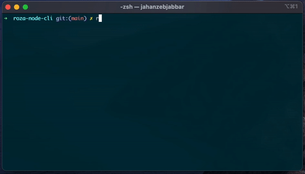
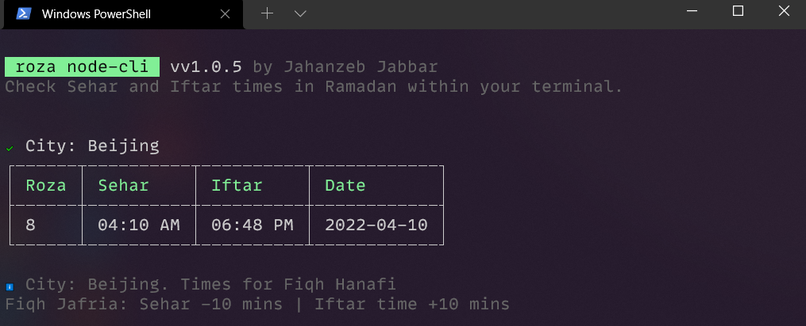

# Roza Node Cli

> CLI to check Ramadan Sehar and Iftar times in the command line..

[](https://www.npmjs.com/package/roza-cli)

<br>

-   🌜 Get Sehar/Iftar times for your city
-   🗓 Get Sehar/Iftar times for entire month of Ramadan
-   Pakistan 60+ cities data including `lahore`, `multan`, `karachi`, `islamabad`, `rawalpindi`, `quetta`, `peshawar`, `hyderabad`,`faisalabad`, `gujranwala`, `sialkot`, `ghotki` and more
-   International cities `beijing`,
    `wuhan`,
    `shanghai`,
    `new-york`,
    `tokyo`,
    `jeddah`,
    `san-francisco`,
    `mumbai`,
    `Guangzhou`,
    `Delhi`,
    `Moscow`,
    `Shenzhen`,
    `dhaka`,
    `seoul`

<br>

## ➕ Install

### Install Node.js
https://nodejs.org/en/download

> Using npx
```sh
npx roza
```
> Install using current directory
```sh
git clone https://github.com/jahanzeb-j/roza-node-cli.git
cd roza-node-cli
npm i -g .
```

<br>

## Usage

```sh
# Show today's Sehar/Iftar.
roza Karachi
npx roza

roza #Show time of default city name

# Show help.
roza help

roza beijing
# Show all days.
npx roza lahore --all
roza karachi -a

# Show next day.
roza beijing -n
roza beijing --next
# Set City Name as Default
roza beijing -d
roza
roza -n

# For multiword cities.
npx roza "new-york" --all
```

## 💻 Output
[](./../../)

[](./../../)

<br>

## 🤝Contribution
> this repo is open for new ideas
- Correct data.
- Add new city.
    - Add JSON to './data/'
    - Add city name to cities.js

<br>

## 📃 License & Conduct

-   MIT © [Jahanzeb](https://twitter.com/jahanzebjabbar/)
-   [Code of Conduct](code-of-conduct.md)

<br>

## ⛓ Connect

<div align="left">
    <p><a href="https://github.com/jahanzeb-j"></a>&nbsp;<small><strong>(follow)</strong> To stay up to date on free & open-source software</small></p>
    <p><a href="https://twitter.com/jahanzebjabbar/"></a>&nbsp;<small><strong>(follow)</strong> To get #OneDevMinute daily hot tips & trolls</small></p>
    <p><a href="https://www.youtube.com/jahanzebkvlogs"></a>&nbsp;<small><strong>(subscribe)</strong> To tech talks & #OneDevMinute videos</small></p>
    <p><a href="https://jahanzebjabbar.com/"></a>&nbsp;<small><strong>(read)</strong> In-depth & long form technical articles</small></p>
    <p><a href="https://www.linkedin.com/in/jahanzeb-jabbar/"></a>&nbsp;<small><strong>(connect)</strong> On the LinkedIn profile y'all</small></p>
</div>

<br>

## 🎈 Credits

<a href="https://github.com/ahmadawais"></a>
Ahmad Awais (https://twitter.com/mrahmadawais/) open-source developer. Thank you for work [ramadan-cli](https://github.com/ahmadawais/ramadan-cli). I further extended his work.
